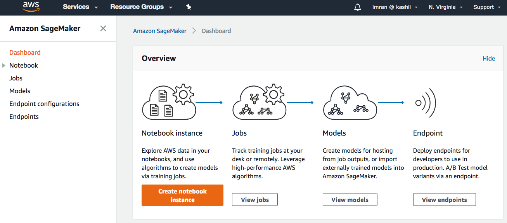
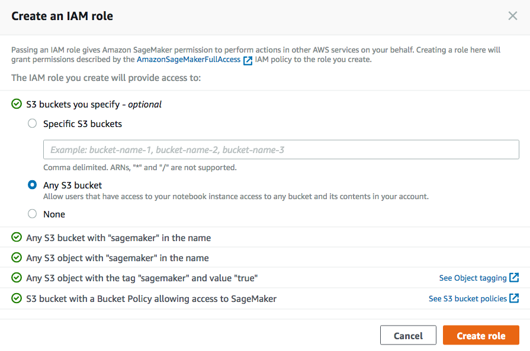
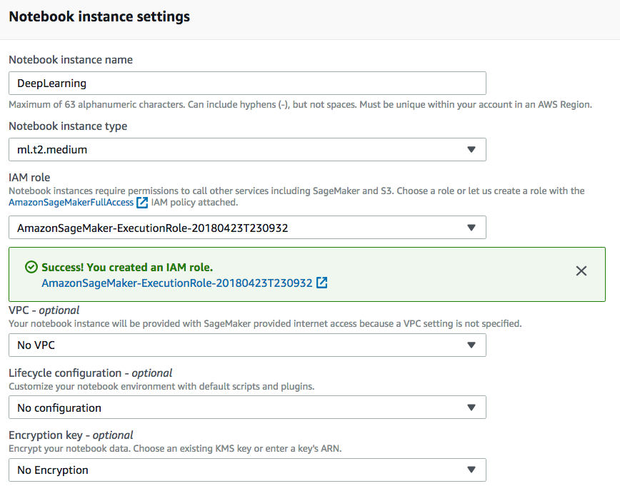
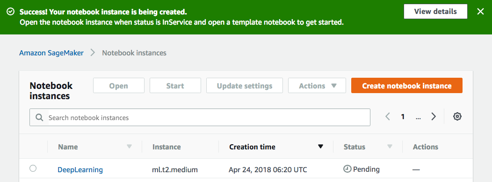
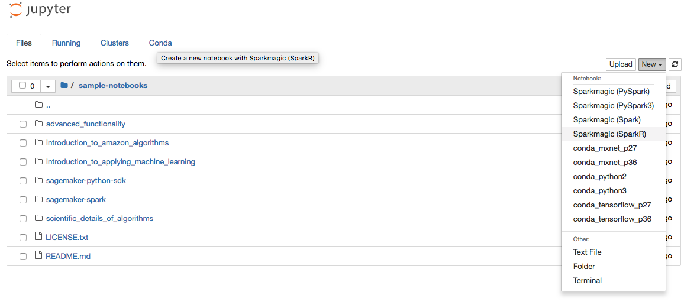
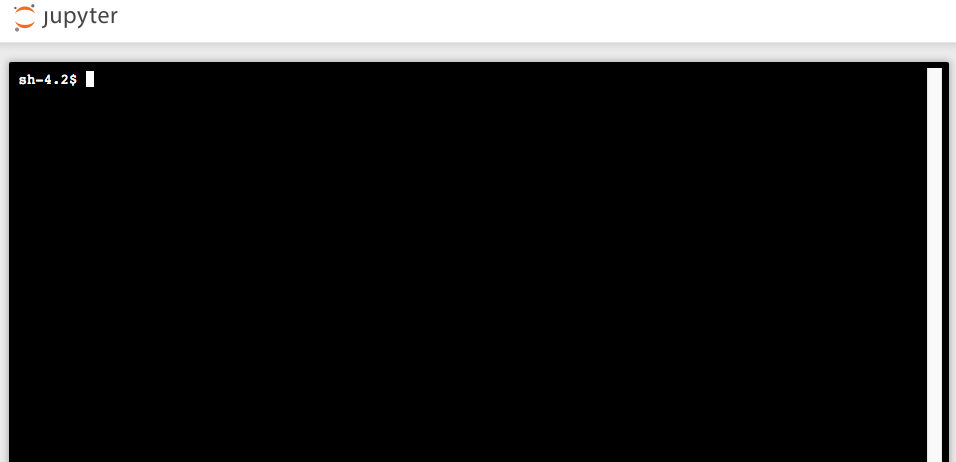
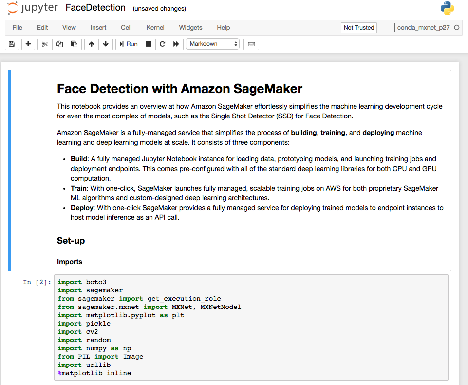
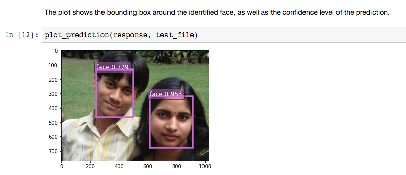

# Build, train and deploy Face Detection model using Amazon SageMaker

In this module, you will learn how to build and train a face detection model using Amazon SageMaker.

## Create SageMaker Notebook Instance

1. Go to SageMaker console at https://console.aws.amazon.com/sagemaker/home?region=us-east-1#/landing
  ___Make sure you have us-east-1 selected as region.___

2. Click on Create Notebook instance

3. Under Notebook instance settings:
- Notebook instance name: Enter a name eg: DeepLearning
- Notebook instance type: ml.t2.medium
- IAM role: Click on 'Create a new role'
  - Under Create an IAM role: Select "Any S3 bucket" and click "Create role".

  

- Leave defaults for VPC, Lifecycle configuration and encryption key and click 'Create notebook instance'.

- You should see message on the next screen that your notebook instance is being created.

## View Notebook Instance

Once the status of your notebook instance is in InService, click on link "Open" under Actions.

You should see Jupyter UI with sample-notebooks folder that contains various sample notebooks.

## Upload and Open Notebook

You can upload individual notebooks using Jypyter UI, but in this lab we will use git to bring notebook in our SageMaker instance.

- Click on New and choose Terminal from the drop down list.

- You should get a console in a new browser tab:

- Type: "cd SageMaker" command to go to SageMaker directory.
- Type: "git clone https://github.com/darwaishx/Deep-Learning-With-Deep-Lens.git" command to clone github repo.
- Type: "ls" command and you should now see a folder "Deep-Learning-With-Deep-Lens"

- Go back to Jupyter UI, and you should see folder "Deep-Learning-With-Deep-Lens".

- Click on "Deep-Learning-With-Deep-Lens", then "2-SageMaker", then "1-FaceDetection" and click on notebook FaceDetection.ipyb

## Execute Notebook

- You can execute notebook cells by either clicking on run button in the menu or using shift+ enter on your keyboard.

- After you successfully train and deploy your face detection model, last cell in the notebook will test the trained model.

